.. _quickstart:

Quick Start
============

This tutorial guides you through RoboMasterPy's components, along with their concepts, relationships and functions.

RoboMasterPy consists of three parts, the SDK, the framework and helper constants/functions.

- The SDK provides near one-to-one binding to RoboMaster's Text API so that we can talk to RoboMaster in a clean and comprehensive way;
- The framework is where your code lives. It deals with control loop, data flow, receiving of video stream, receiving of pushes and events, logging so you don't have to;
- Helpers are some good-to-have features that may be useful for your task.

SDK
---------------------

Create a ``Commander`` to talk to your RoboMaster::

    >>> import robomasterpy as rm

    # IP of RoboMaster is detected under router mode
    >>> cmd = rm.Commander()

    # check RoboMaster's API version
    >>> cmd.version()
    'version 00.00.00.60'

    >>> cmd.get_robot_mode()
    'chassis_lead'

    # ensure your Robomaster has enough room to move
    >>> cmd.chassis_move(x=-1, z=30)
    'ok'

    # activate video streaming,
    # which can be handled by the framework.
    >>> cmd.stream(rm.SWITCH_ON)
    'ok'

    # activate gimbal attitude push at 5Hz,
    # which can be handled by the framework.
    >>> cmd.gimbal_push_on(attitude_freq=5)
    'ok'

    # Watch out!
    >>> cmd.blaster_fire()
    'ok'

Usually, methods for info query start with ``get_``. Refer to :ref:`API documentation <api>` for a full list of methods.

Some useful notes:

- Robomaster's IP in USB mode is ``192.168.42.2``, and ``192.168.2.1`` in direct mode;
- Commander is ready to use once it is created, and exceptions will raise if creation fails;
- Call Commander's ``close`` method will free its system socket resource, though Commander will NOT send ``quit;`` command to Robomaster since there may be other Commander working;
- It's common to have two or more Commander instances on different processes, connected to the same Robomaster, at the same time;
- Commander uses mutex to ensure there is only one command from a instance sent to Robomaster at one time;
- Methods that moves gimbal usually do not response(that's to say, blocks) until the end of gimbal moving, so it may be a good idea to have a loose timeout.

Framework
--------------------------------

Hub and Workers
^^^^^^^^^^^^^^^^^^^^^^^^^^

RoboMasterPy framework is built upon Python multiprocessing package. To use the framework, you need to divide your code into parts, by their functionality, like vision, event handling, control.

Every part which inherits ``worker``, runs at the same time. Workers communicates by multiprocessing's Queue.

Workers are registered under one ``Hub``, who is in charge of orchestration and graceful shutdown.

RoboMasterPy comes with some sugared worker to satisfy common needs, their names are self-explanatory.

You can always inherit and implement your own worker if sugared ones do not cover your need.

Here is a example showing how Hub and Workers works::

    @click.command()
    @click.option('--ip', default='', type=str, help='(Optional) IP of Robomaster EP')
    @click.option('--timeout', default=10.0, type=float, help='(Optional) Timeout for commands')
    def cli(ip: str, timeout: float):
        # manager is in charge of communicating among processes
        manager: mp.managers.SyncManager = CTX.Manager()

        with manager:
            # hub is the place to register your logic
            hub = rmf.Hub()
            cmd = rm.Commander(ip=ip, timeout=timeout)
            ip = cmd.get_ip()

            # initialize your Robomaster
            cmd.robot_mode(rm.MODE_GIMBAL_LEAD)
            cmd.gimbal_recenter()

            # enable video streaming
            cmd.stream(True)
            # rm.Vision is a handler for video streaming
            # display is the callback function defined by user
            hub.worker(rmf.Vision, 'vision', (None, ip, display))

            # enable push and event
            cmd.chassis_push_on(PUSH_FREQUENCY, PUSH_FREQUENCY, PUSH_FREQUENCY)
            cmd.gimbal_push_on(PUSH_FREQUENCY)
            cmd.armor_sensitivity(10)
            cmd.armor_event(rm.ARMOR_HIT, True)
            cmd.sound_event(rm.SOUND_APPLAUSE, True)

            # the queues are where data flows
            push_queue = manager.Queue(QUEUE_SIZE)
            event_queue = manager.Queue(QUEUE_SIZE)

            # PushListener and EventListener handles push and event,
            # put parsed, well-defined data into queues.
            hub.worker(rmf.PushListener, 'push', (push_queue,))
            hub.worker(rmf.EventListener, 'event', (event_queue, ip))

            # Mind is the handler to let you bring your own controlling logic.
            # Here the logic is in the function named handle_event.
            # It can consume data from specified queues.
            hub.worker(rmf.Mind, 'event-handler', ((push_queue, event_queue), ip, handle_event))

            # a hub can have multiple Mind
            # Here the logic is in the function named control.
            hub.worker(rmf.Mind, 'controller', ((), ip, control), {'loop': False})

            # run() start all the registered workers, blocks until SIGTERM or SIGINT
            hub.run()

    if __name__ == '__main__':
        cli()

Full example can be found `here <https://github.com/nanmu42/robo-playground/blob/2274f1a311546c47a1705b20bb115cdd05cd8326/drive.py#L158-L198>`_.

Flow of Data
^^^^^^^^^^^^^

The data flow of example above:

An one-way, clear flow of data keeps the application simple and maintainable.

Helpers
----------------------------

Helpers are some good-to-have features that may be useful for your task.
Refer to :ref:`API documentation <api>` for details.

RoboMasterPy by Example
------------------------------------------

Here are some runnable examples which you may use as start point.

* `Drive your robomaster using keyboard <https://github.com/nanmu42/robo-playground#drive-your-robomaster-using-keyboard>`_;
* `Make your robomaster a goalkeeper <https://github.com/nanmu42/robo-playground#make-your-robomaster-a-goalkeeper>`_;
* `More examples <https://github.com/nanmu42/robo-playground>`_.